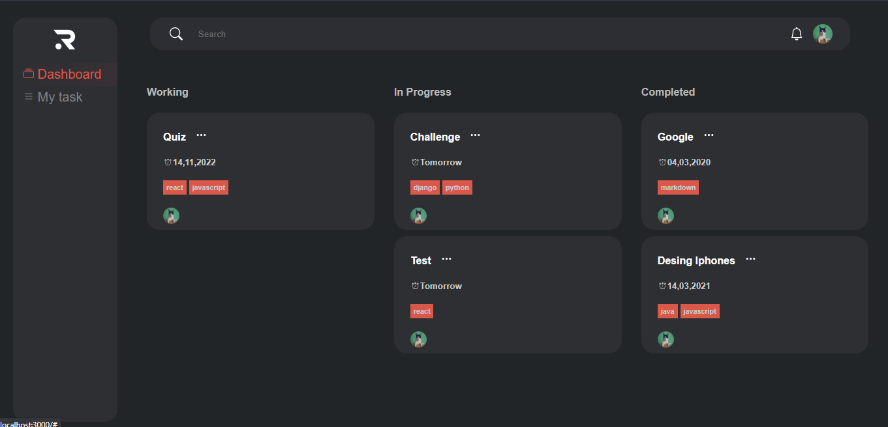

# React app challenge

This project was bootstrapped with [Create React App](https://github.com/facebook/create-react-app).

## Available Scripts

**Note: The current state of the application does not require any configuration on the server or the configuration of any API**

In the project directory, you can run:

### `npm start`

Runs the app in the development mode.\
Open [http://localhost:3000](http://localhost:3000) to view it in your browser.

The page will reload when you make changes.\
You may also see any lint errors in the console.

### `npm test`

Launches the test runner in the interactive watch mode.\
See the section about [running tests](https://facebook.github.io/create-react-app/docs/running-tests) for more information.

## Progress

Almost all of the visual components in the application were completed, to emulate the data obtained from the server, data was inserted manually

However the functional components that interact with the backend are not active

- A design similar to that of the example is chosen for a better guide.
- The sidebar has been shortened laterally to give more space for the task cards.
- In this phase, the focus is more on the visual components.